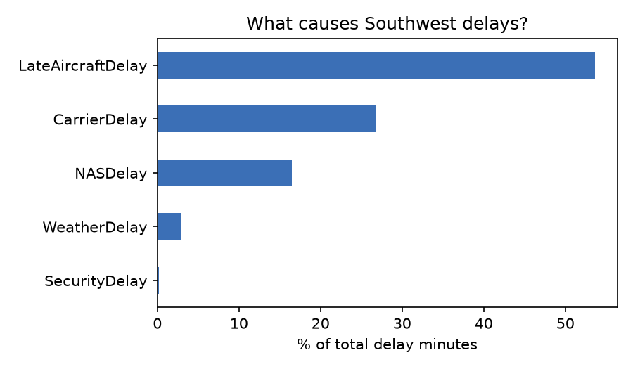
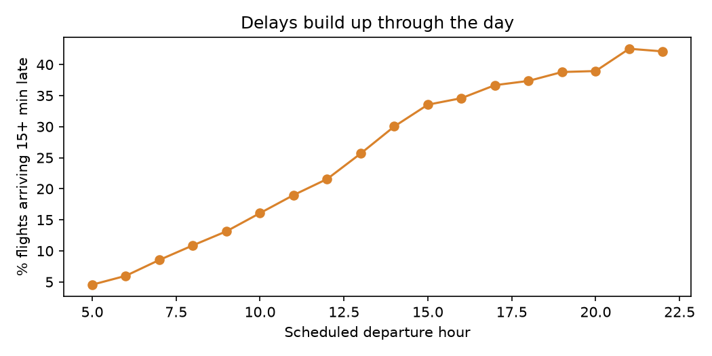
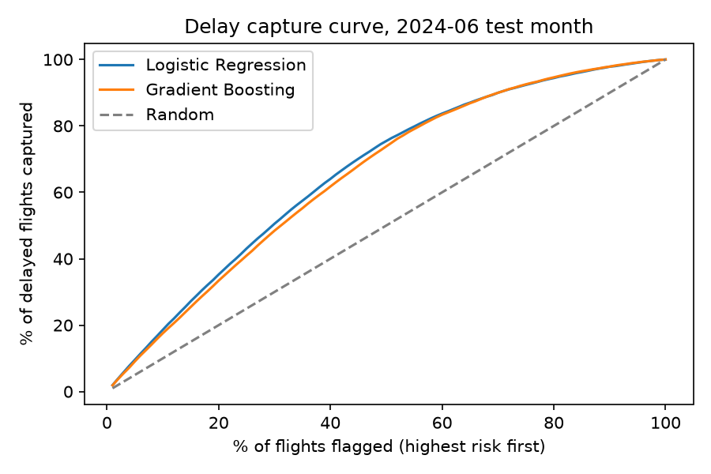

# TurnTime: Airline Delay Intelligence

Analyzes Southwest Airlines on-time performance from U.S. DOT flight records, finds what drives delays, and predicts which flights are likely to arrive 15+ minutes late **using only information available before departure**. A Streamlit dashboard presents ops KPIs and a route-level delay risk tool.

**Stack:** Python · SQL (DuckDB) · pandas · scikit-learn (HistGradientBoosting, Logistic Regression) · Matplotlib · Streamlit

**Live dashboard:** _add your Streamlit Cloud link here_

---

## Business Questions

1. What is Southwest's on-time rate, and which delay causes cost the most minutes?
2. How do delays propagate through the day?
3. Which airports and routes are delay hotspots?
4. Can we flag high-risk flights in advance so ops can prioritize turnaround crews and spare aircraft?

## Data

[BTS Airline On-Time Performance](https://www.transtats.bts.gov/) (U.S. Department of Transportation), Reporting Carrier On-Time Performance, filtered to Southwest (carrier code `WN`). `src/download_data.py` downloads and filters it automatically. Southwest operates roughly 4,000 daily flights, so three months is several hundred thousand flights.

## Approach

**Part A, Operations analytics**
- KPIs: on-time arrival rate, cancellation rate, average delay when late
- Delay minutes split by cause: carrier, late-arriving aircraft, airspace (NAS), weather, security
- Delay rate by scheduled departure hour (delay propagation)
- Highest-delay origin airports (minimum-volume filter to avoid noise from small airports)

**SQL KPI layer** ([`sql/kpi_queries.sql`](sql/kpi_queries.sql), run with `src/run_sql.py`)
- Monthly on-time % with month-over-month change (`LAG`)
- Delay-minute share by cause (`UNPIVOT`, windowed totals)
- Airport delay ranking with `RANK()` and `PERCENT_RANK()`
- Routes with the most total delay minutes
- Delay propagation by hour with a running cumulative share (`SUM() OVER (ORDER BY ...)`)
- Day-of-week performance vs. average
- Results: [`results/sql_results.md`](results/sql_results.md)

**Part B, Delay prediction**
- **Leakage control.** Excluded departure delay and the delay-cause columns. They are only known after the flight, and using them makes the model look perfect but useless in practice.
- **Time-based split.** Trained on earlier months and tested on the final month, mimicking real forecasting.
- **Feature engineering**
  - Scheduled departure/arrival hour, day of week, weekend flag, distance
  - `origin_hour_departures`: scheduled flights leaving the same airport in the same hour (congestion, known in advance)
  - Smoothed historical delay rates per route, origin, destination, and hour, **computed from training data only**
- **Models.** Logistic Regression baseline vs. HistGradientBoosting, both class-balanced.
- **Business metric.** Share of delayed flights captured when ops focuses on the riskiest 20% of flights (lift over random).

## Results

> Full output: [`results/results.md`](results/results.md)

<!-- Paste key numbers from results/results.md after running train.py -->

| Metric | Value |
|---|---|
| Flights analyzed | _from results.md_ |
| On-time arrival rate | _from results.md_ |
| Largest delay cause | _from results.md_ |
| Delayed flights captured in top-20% risk | _from results.md_ |
| ROC-AUC (test month) | _from results.md_ |





**Note on accuracy:** Delays depend heavily on same-day weather and upstream aircraft, which aren't known in advance. A pre-departure model will not be near-perfect. The value is in ranking risk so resources go where delays are most likely.

## Run It

```bash
pip install -r requirements.txt
python src/download_data.py --year 2024 --months 4 5 6
python src/run_sql.py
python src/train.py
streamlit run app.py
```

## Next Steps

- Add hourly weather (NOAA) at origin and destination
- Model aircraft rotation (tail number) to capture delay propagation directly
- Expand to a full year to capture seasonality
